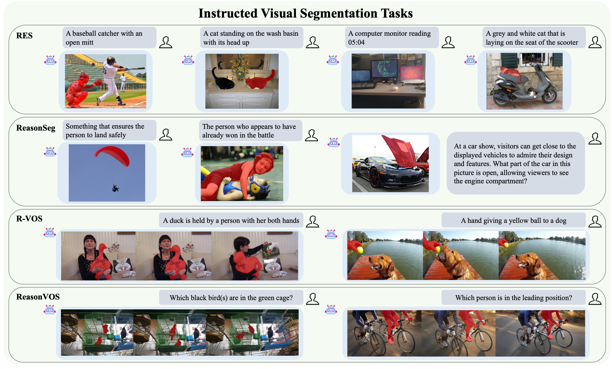
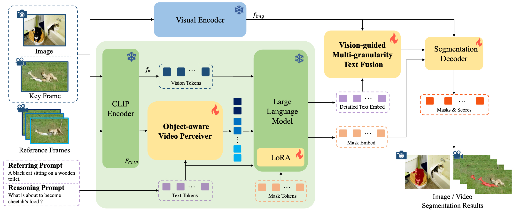
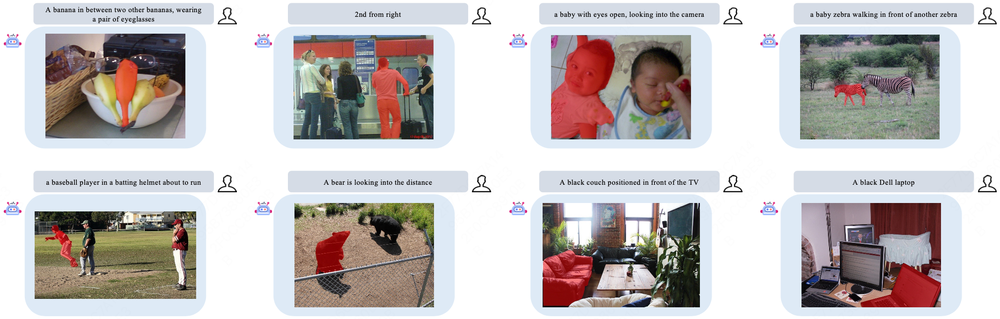
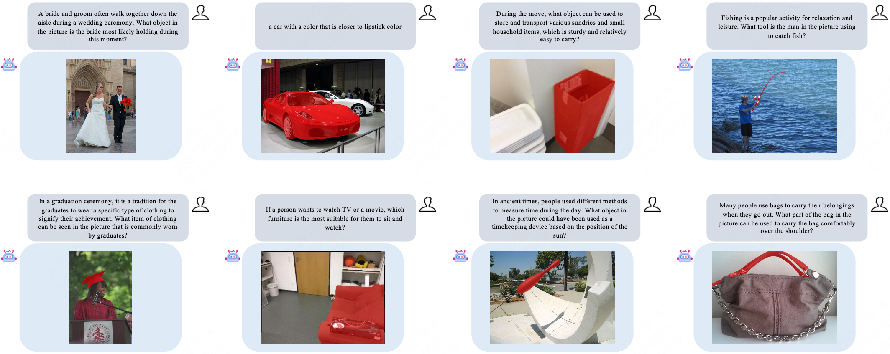
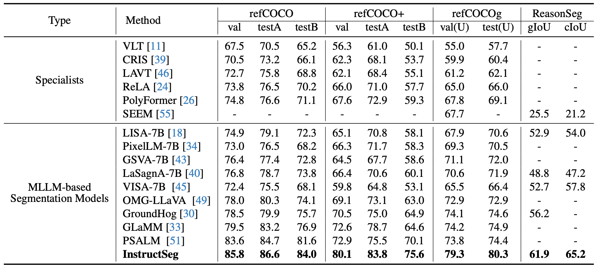
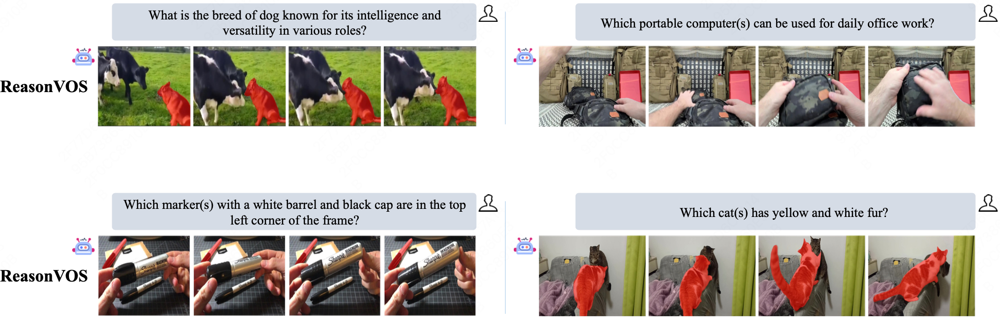
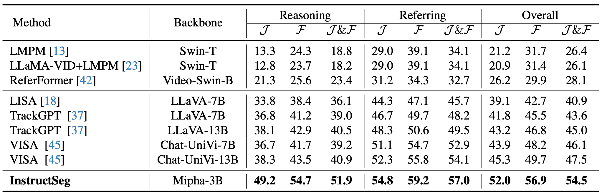
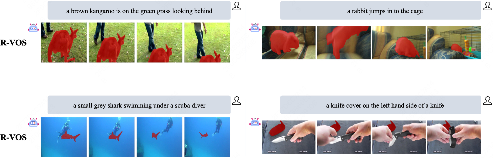
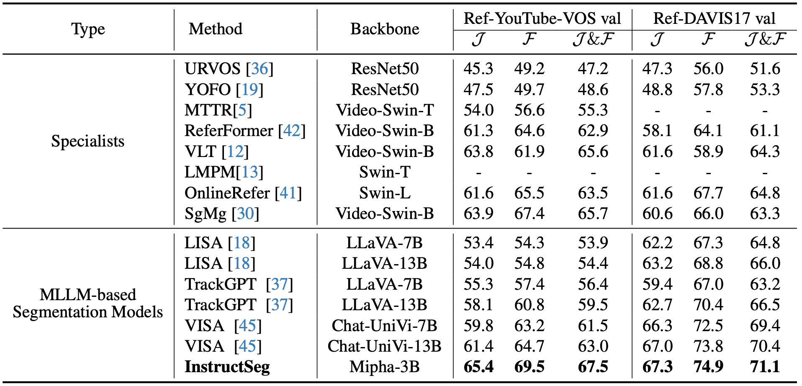
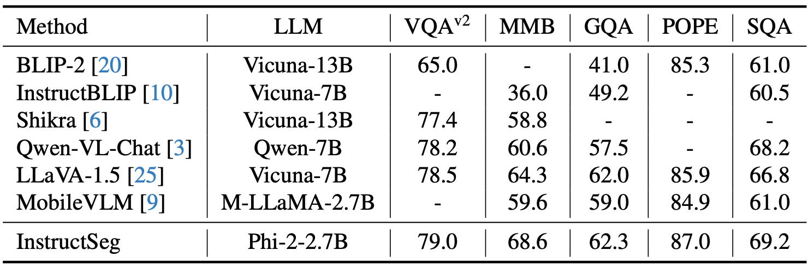

# InstructSeg: Unifying Instructed Visual Segmentation with Multi-modal Large Language Models

[](https://arxiv.org/abs/2412.14006)


## 📢 News
- Release InstructSeg project page.
- Our model and code is coming soon.


## 📚 Abstract
Boosted by Multi-modal Large Language Models (MLLMs), text-guided universal segmentation models for the image and video domains have made rapid progress recently. However, these methods are often developed separately for specific domains, overlooking the similarities in task settings and solutions across these two areas. In this paper, we define the union of referring segmentation and reasoning segmentation at both the image and video levels as Instructed Visual Segmentation (IVS). Correspondingly, we propose InstructSeg, an end-to-end segmentation pipeline equipped with MLLMs for IVS. Specifically, we employ an object-aware video perceiver to extract temporal and object information from reference frames, facilitating comprehensive video understanding. Additionally, we introduce vision-guided multi-granularity text fusion to better integrate global and detailed text information with fine-grained visual guidance. By leveraging multi-task and end-to-end training, InstructSeg demonstrates superior performance across diverse image and video segmentation tasks, surpassing both segmentation specialists and MLLM-based methods with a single model.


## 🚀 Contributions

- **Instructed Visual Segmentation Tasks.** We unify referring segmentation and reasoning segmentation in both the image and video domains under the framework of Instructed Visual Segmentation (IVS). IVS is defined as segmenting targets from visual inputs based on detailed textual instructions.

- **InstructSeg Model.** We present InstructSeg, an end-to-end unified pipeline for Instructed Visual Segmentation, leveraging Multi-modal Large Language Models for language-instructed pixel-level reasoning and classification. This model effectively handles tasks across both image and video domains while maintaining a high level of simplicity.

- **Superior Performance.** Our InstructSeg achieves state-of-the-art results on diverse Instructed Visual Segmentation benchmarks across both image and video domains, demonstrating the effectiveness of our simplified pipeline. Furthermore, InstructSeg also presents competitive performance on multiple Multi-modal benchmarks.


## 🔍 Getting started with InstructSeg


- [**Installation**](docs/INSTALL.md): We provide guidance to create environment and install required packages.

- [**Datasets**](docs/DATASET.md): We provide guidance to download and change formats of datasets required for this project.

- [**Model Weight**](https://huggingface.co/weic22/InstructSeg): We provide the pretrained InstructSeg model weights [InstructSeg](https://huggingface.co/weic22/InstructSeg).

- [**Training**](docs/TRAINING.md): We provide scripts on how to train the InstructSeg model for all the Instructed Visual Segmentation Tasks.

- [**Evaluation**](docs/INFERENCE.md): We provide scripts for evaluating the performance of InstructSeg on Instructed Visual Segmentation Tasks across image and video domains.


## 👁️ Instructed Visual Segmentation (IVS) Tasks

We define Instructed Visual Segmentation (IVS) as the union of four text-guided segmentation tasks across image and video domains: referring expression segmentation (RES), reasoning segmentation (ReasonSeg), referring video object segmentation (R-VOS) and reasoning video object segmentation (ReasonVOS). 
<p align="center">
 
</p>


## 🤖 Pipeline of InstructSeg
<p align="center">
 
</p>


## 🌟 Results
### RES & ReasonSeg

<p align="center">
 
</p>

<p align="center">
 
</p>

<p align="center">
 
</p>

### Reasoning Video Object Segmentation
<p align="center">
 
</p>

<p align="center">
 
</p>

### Referring Video Object Segmentation
<p align="center">
 
</p>

<p align="center">
 
</p>

### Multi-modal Question Answering Benchmarks
<p align="center">
 
</p>


## 📚 Citation 
Consider citing:

```
@article{wei2024instructseg,
  title={InstructSeg: Unifying Instructed Visual Segmentation with Multi-modal Large Language Models},
  author={Wei, Cong and Zhong, Yujie and Tan, Haoxian and Zeng, Yingsen and Liu, Yong and Zhao, Zheng and Yang, Yujiu},
  journal={arXiv preprint arXiv:2412.14006},
  year={2024}
}
```


## Acknowledgement
-  Thankful to Mipha, Mask2Former, and PSALM.

